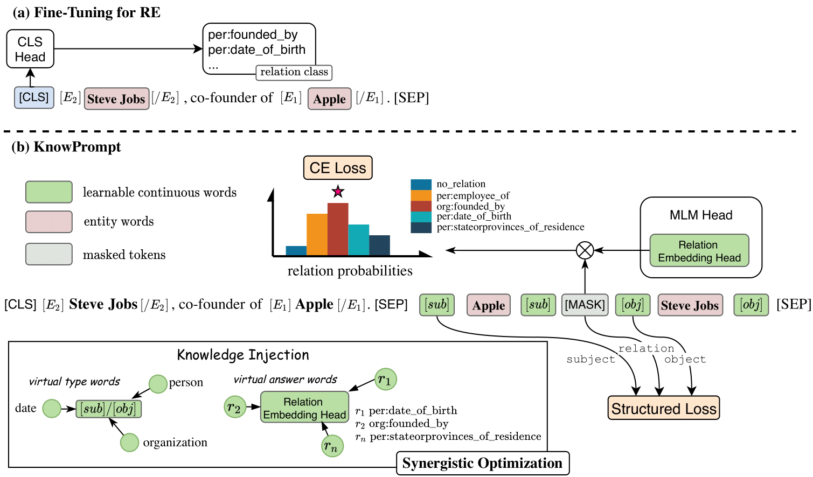

# KnowPrompt


Code and datasets for the WWW2022 paper [KnowPrompt: Knowledge-aware Prompt-tuning  with  Synergistic Optimization for Relation Extraction](https://arxiv.org/pdf/2104.07650.pdf). 

<div align=center></div>

# What's New

## Sept,21 2022
* Our follow-up paper on prompting NLP [Decoupling Knowledge from Memorization: Retrieval-augmented Prompt Learning](https://arxiv.org/abs/2205.14704) has been accepted by NeurIPS2022. The project address is visible at [RetroPrompt](https://github.com/zjunlp/PromptKG/tree/main/research/RetroPrompt).

## March,30 2022
* Our follow-up paper on prompting RE [Relation Extraction as Open-book Examination: Retrieval-enhanced Prompt Tuning](https://arxiv.org/abs/2205.02355) has been accepted by SIGIR2022. The project address is visible at [RetrievalRE](https://github.com/zjunlp/PromptKG/tree/main/research/RetrievalRE).

## Jan,14 2022
* Our paper [KnowPrompt: Knowledge-aware Prompt-tuning with Synergistic Optimization for Relation Extraction](https://arxiv.org/abs/2104.07650) has been accepted by WWW2022.


# Requirements

It is recommended to use a virtual environment to run KnowPrompt.

```bash
conda create -n knowprompt python=3.8

conda activate knowprompt
```

To install requirements:

```
pip install -r requirements.txt
```

Datasets
==========

We provide all the datasets and prompts used in our experiments.

+ [[SEMEVAL]](dataset/semeval)

+ [[DialogRE]](dataset/dialogue)

+ [[TACRED-Revisit]](dataset/tacrev)

+ [[Re-TACRED]](dataset/retacred)

+ [[TACRED]](dataset/tacred)

The expected structure of files is:


```
knowprompt
 |-- dataset
 |    |-- semeval
 |    |    |-- train.txt       
 |    |    |-- dev.txt
 |    |    |-- test.txt
 |    |    |-- temp.txt
 |    |    |-- rel2id.json
 |    |-- dialogue
 |    |    |-- train.json       
 |    |    |-- dev.json
 |    |    |-- test.json
 |    |    |-- rel2id.json
 |    |-- tacred
 |    |    |-- train.txt       
 |    |    |-- dev.txt
 |    |    |-- test.txt
 |    |    |-- temp.txt
 |    |    |-- rel2id.json
 |    |-- tacrev
 |    |    |-- train.txt       
 |    |    |-- dev.txt
 |    |    |-- test.txt
 |    |    |-- temp.txt
 |    |    |-- rel2id.json
 |    |-- retacred
 |    |    |-- train.txt       
 |    |    |-- dev.txt
 |    |    |-- test.txt
 |    |    |-- temp.txt
 |    |    |-- rel2id.json
 |-- scripts
 |    |-- semeval.sh
 |    |-- dialogue.sh
 |    |-- ...
 
```


Run the experiments
==========

## Initialize the answer words

Use the comand below to get the answer words to use in the training.

```shell
python get_label_word.py --model_name_or_path bert-large-uncased  --dataset_name semeval
```

The `{answer_words}.pt`will be saved in the dataset, you need to assign the `model_name_or_path` and `dataset_name` in the `get_label_word.py`.

## Split dataset

Download the data first, and put it to `dataset` folder. Run the comand below, and get the few shot dataset.

```shell
python generate_k_shot.py --data_dir ./dataset --k 8 --dataset semeval
cd dataset
cd semeval
cp rel2id.json val.txt test.txt ./k-shot/8-1
```
You need to modify the `k` and `dataset` to assign k-shot and dataset. Here we default seed as 1,2,3,4,5 to split each k-shot, you can revise it in the `generate_k_shot.py`

## Let's run

Our script code can automatically run the experiments in 8-shot, 16-shot, 32-shot and 
standard supervised settings with both the procedures of train, eval and test. We just choose the random seed to be 1 as an example in our code. Actually you can perform multiple experments with different seeds.

#### Example for SEMEVAL
Train the KonwPrompt model on SEMEVAL with the following command:

```bash
>> bash scripts/semeval.sh  # for roberta-large
```
As the scripts  for `TACRED-Revist`, `Re-TACRED`, `Wiki80` included in our paper are also provided, you just need to run it like above example.

#### Example for DialogRE
As the data format of DialogRE is very different from other dataset, Class of processor is also different. 
Train the KonwPrompt model on DialogRE with the following command:

```bash
>> bash scripts/dialogue.sh  # for roberta-base
```

## More emperical results

We report emperical results on more datasets in the EMNLP 2022 (Findings) paper "[Towards Realistic Low-resource Relation Extraction: A Benchmark with Empirical Baseline Study](https://arxiv.org/pdf/2210.10678.pdf)" [[code](https://github.com/zjunlp/LREBench)].

# Acknowledgement

Part of our code is borrowed from [code](https://github.com/thunlp/PTR) of [PTR: Prompt Tuning with Rules for Text Classification](https://arxiv.org/abs/2105.11259), many thanks.

# Citation
If you use the code, please cite the following paper:


```bibtex
@inproceedings{DBLP:conf/www/ChenZXDYTHSC22,
  author    = {Xiang Chen and
               Ningyu Zhang and
               Xin Xie and
               Shumin Deng and
               Yunzhi Yao and
               Chuanqi Tan and
               Fei Huang and
               Luo Si and
               Huajun Chen},
  editor    = {Fr{\'{e}}d{\'{e}}rique Laforest and
               Rapha{\"{e}}l Troncy and
               Elena Simperl and
               Deepak Agarwal and
               Aristides Gionis and
               Ivan Herman and
               Lionel M{\'{e}}dini},
  title     = {KnowPrompt: Knowledge-aware Prompt-tuning with Synergistic Optimization
               for Relation Extraction},
  booktitle = {{WWW} '22: The {ACM} Web Conference 2022, Virtual Event, Lyon, France,
               April 25 - 29, 2022},
  pages     = {2778--2788},
  publisher = {{ACM}},
  year      = {2022},
  url       = {https://doi.org/10.1145/3485447.3511998},
  doi       = {10.1145/3485447.3511998},
  timestamp = {Tue, 26 Apr 2022 16:02:09 +0200},
  biburl    = {https://dblp.org/rec/conf/www/ChenZXDYTHSC22.bib},
  bibsource = {dblp computer science bibliography, https://dblp.org}
}
```
